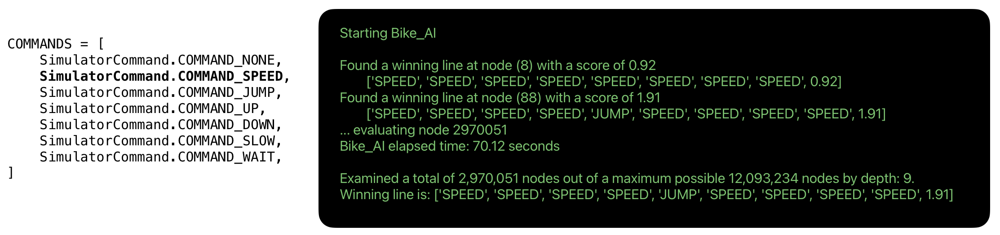

# My general approach

> ⤴️ [README.md](../README.md#how-i-addressed-this-challenge)

I approached this problem by first ensuring I understood how the online simulator works, i.e., how it interpretes the use of the six possible moves per turn.

To do this I first built a `simulation_tester.py` module which is functionally similar to the online one - even in how it uses operating system pipes to communicate with the child process that hosts the client AI.

The online site provides a series of test cases that I used to test my AI.  I encoded those test cases in the `simulations.py` module which is used by the `simulation_tester.py` module. This allowed me to iterate on my AI locally without having to use the online site. I considered that necessary in order to be able to debug my AI, but also to be able to test my AI with shorter and custom test cases.

Personally, I like to use docker containerized environments and Visual Studio Code's remote development features to work on projects.  This allows me to use my local IDE and tools while still having a consistent environment.

- [Docker instructions](documentation/docker.md)

## Simulation console output

By building a local simulation tester I was able to capture the console output of the simulation.  This allowed me to see the state of the game at each turn and to see the moves that were being made by my AI.  This was very helpful in debugging my AI.



In the above example we see that an earlier version of the AI found two winning moves but took 70 seconds to do so on a Mac M1 MAX Pro. Part of the problem was that it had to create and evaluate 2.9 million nodes out of a possible 12 million nodes by the 9th ply.

In this next (but differnt) example, we see that an updated AI found the winning move in 0.0108 seconds by only evaluating 208 nodes out of a possible 731,231,688,012,594 nodes at the 19th ply.

```shell
Starting Bike_AI on Sim 12

Found a winning line at node (161) with a score of 0.81 in 0.0108 seconds
        ['SPEED', 'DOWN', 'SPEED', 'UP', 'JUMP', 'UP', 'SLOW', 'DOWN', 'DOWN', 'SPEED', 'JUMP', 'UP', 'SPEED', 'SPEED', 'JUMP', 'UP', 'UP', 'SPEED', 'JUMP', 0.81]
... adding node 208
Bike_AI elapsed time: 0.01 seconds.
Examined a total of 208 nodes out of a maximum possible 731,231,688,012,594 nodes by depth: 19
Winning line is: ['SPEED', 'DOWN', 'SPEED', 'UP', 'JUMP', 'UP', 'SLOW', 'DOWN', 'DOWN', 'SPEED', 'JUMP', 'UP', 'SPEED', 'SPEED', 'JUMP', 'UP', 'UP', 'SPEED', 'JUMP', 0.81]
```

Here is the console output per iteration. Note, the following output is made possible by the [Simulator.render()](https://github.com/cjus/the-bridge-episode-2/blob/main/source/simulator.py#L91) method.

At the starting position there are two bikes marked #1 and #2, starting at position 0. The x's represent the pot holes. The '.' represent a safe part of the bridge.

```shell
Speed: 1
00000000001111111111222222222233333333334444444444555555555566666
01234567890123456789012345678901234567890123456789012345678901234
-----------------------------------------------------------------
................xxxxxxxxx........xxxxx........xxx.............xx.
1x.x..................xxx....xxx......x.x..................xxxxx.
2...xxx.........x.x...xxx................xxx............xxxxxx.x.
............x.xxxxxx...........xxxx...............x.x.....xxxxxx.
```

The next iterations show the play by play of the game. At this point we lose bike #1 at position 1 due to a pot hole.

```shell
Processing: SPEED
Speed: 2
00000000001111111111222222222233333333334444444444555555555566666
01234567890123456789012345678901234567890123456789012345678901234
-----------------------------------------------------------------
................xxxxxxxxx........xxxxx........xxx.............xx.
.1.x..................xxx....xxx......x.x..................xxxxx.
..2.xxx.........x.x...xxx................xxx............xxxxxx.x.
............x.xxxxxx...........xxxx...............x.x.....xxxxxx.
```

```shell
Processing: DOWN
Speed: 2
00000000001111111111222222222233333333334444444444555555555566666
01234567890123456789012345678901234567890123456789012345678901234
-----------------------------------------------------------------
................xxxxxxxxx........xxxxx........xxx.............xx.
.1.x..................xxx....xxx......x.x..................xxxxx.
....xxx.........x.x...xxx................xxx............xxxxxx.x.
....2.......x.xxxxxx...........xxxx...............x.x.....xxxxxx.
```

Bike #2 continues on to position 7. In the next outputs we see bike #2 continue its progression accross the bridge.

```shell
Processing: SPEED
Speed: 3
00000000001111111111222222222233333333334444444444555555555566666
01234567890123456789012345678901234567890123456789012345678901234
-----------------------------------------------------------------
................xxxxxxxxx........xxxxx........xxx.............xx.
.1.x..................xxx....xxx......x.x..................xxxxx.
....xxx.........x.x...xxx................xxx............xxxxxx.x.
.......2....x.xxxxxx...........xxxx...............x.x.....xxxxxx.

Processing: UP
Speed: 3
00000000001111111111222222222233333333334444444444555555555566666
01234567890123456789012345678901234567890123456789012345678901234
-----------------------------------------------------------------
................xxxxxxxxx........xxxxx........xxx.............xx.
.1.x..................xxx....xxx......x.x..................xxxxx.
....xxx...2.....x.x...xxx................xxx............xxxxxx.x.
............x.xxxxxx...........xxxx...............x.x.....xxxxxx.

Processing: JUMP
Speed: 3
00000000001111111111222222222233333333334444444444555555555566666
01234567890123456789012345678901234567890123456789012345678901234
-----------------------------------------------------------------
................xxxxxxxxx........xxxxx........xxx.............xx.
.1.x..................xxx....xxx......x.x..................xxxxx.
....xxx......2..x.x...xxx................xxx............xxxxxx.x.
............x.xxxxxx...........xxxx...............x.x.....xxxxxx.

Processing: UP
Speed: 3
00000000001111111111222222222233333333334444444444555555555566666
01234567890123456789012345678901234567890123456789012345678901234
-----------------------------------------------------------------
................xxxxxxxxx........xxxxx........xxx.............xx.
.1.x............2.....xxx....xxx......x.x..................xxxxx.
....xxx.........x.x...xxx................xxx............xxxxxx.x.
............x.xxxxxx...........xxxx...............x.x.....xxxxxx.

Processing: SLOW
Speed: 2
00000000001111111111222222222233333333334444444444555555555566666
01234567890123456789012345678901234567890123456789012345678901234
-----------------------------------------------------------------
................xxxxxxxxx........xxxxx........xxx.............xx.
.1.x..............2...xxx....xxx......x.x..................xxxxx.
....xxx.........x.x...xxx................xxx............xxxxxx.x.
............x.xxxxxx...........xxxx...............x.x.....xxxxxx.

Processing: DOWN
Speed: 2
00000000001111111111222222222233333333334444444444555555555566666
01234567890123456789012345678901234567890123456789012345678901234
-----------------------------------------------------------------
................xxxxxxxxx........xxxxx........xxx.............xx.
.1.x..................xxx....xxx......x.x..................xxxxx.
....xxx.........x.x.2.xxx................xxx............xxxxxx.x.
............x.xxxxxx...........xxxx...............x.x.....xxxxxx.

Processing: DOWN
Speed: 2
00000000001111111111222222222233333333334444444444555555555566666
01234567890123456789012345678901234567890123456789012345678901234
-----------------------------------------------------------------
................xxxxxxxxx........xxxxx........xxx.............xx.
.1.x..................xxx....xxx......x.x..................xxxxx.
....xxx.........x.x...xxx................xxx............xxxxxx.x.
............x.xxxxxx..2........xxxx...............x.x.....xxxxxx.

Processing: SPEED
Speed: 3
00000000001111111111222222222233333333334444444444555555555566666
01234567890123456789012345678901234567890123456789012345678901234
-----------------------------------------------------------------
................xxxxxxxxx........xxxxx........xxx.............xx.
.1.x..................xxx....xxx......x.x..................xxxxx.
....xxx.........x.x...xxx................xxx............xxxxxx.x.
............x.xxxxxx.....2.....xxxx...............x.x.....xxxxxx.

Processing: JUMP
Speed: 3
00000000001111111111222222222233333333334444444444555555555566666
01234567890123456789012345678901234567890123456789012345678901234
-----------------------------------------------------------------
................xxxxxxxxx........xxxxx........xxx.............xx.
.1.x..................xxx....xxx......x.x..................xxxxx.
....xxx.........x.x...xxx................xxx............xxxxxx.x.
............x.xxxxxx........2..xxxx...............x.x.....xxxxxx.

Processing: UP
Speed: 3
00000000001111111111222222222233333333334444444444555555555566666
01234567890123456789012345678901234567890123456789012345678901234
-----------------------------------------------------------------
................xxxxxxxxx........xxxxx........xxx.............xx.
.1.x..................xxx....xxx......x.x..................xxxxx.
....xxx.........x.x...xxx......2.........xxx............xxxxxx.x.
............x.xxxxxx...........xxxx...............x.x.....xxxxxx.

Processing: SPEED
Speed: 4
00000000001111111111222222222233333333334444444444555555555566666
01234567890123456789012345678901234567890123456789012345678901234
-----------------------------------------------------------------
................xxxxxxxxx........xxxxx........xxx.............xx.
.1.x..................xxx....xxx......x.x..................xxxxx.
....xxx.........x.x...xxx..........2.....xxx............xxxxxx.x.
............x.xxxxxx...........xxxx...............x.x.....xxxxxx.

Processing: SPEED
Speed: 5
00000000001111111111222222222233333333334444444444555555555566666
01234567890123456789012345678901234567890123456789012345678901234
-----------------------------------------------------------------
................xxxxxxxxx........xxxxx........xxx.............xx.
.1.x..................xxx....xxx......x.x..................xxxxx.
....xxx.........x.x...xxx...............2xxx............xxxxxx.x.
............x.xxxxxx...........xxxx...............x.x.....xxxxxx.

Processing: JUMP
Speed: 5
00000000001111111111222222222233333333334444444444555555555566666
01234567890123456789012345678901234567890123456789012345678901234
-----------------------------------------------------------------
................xxxxxxxxx........xxxxx........xxx.............xx.
.1.x..................xxx....xxx......x.x..................xxxxx.
....xxx.........x.x...xxx................xxx.2..........xxxxxx.x.
............x.xxxxxx...........xxxx...............x.x.....xxxxxx.

Processing: UP
Speed: 5
00000000001111111111222222222233333333334444444444555555555566666
01234567890123456789012345678901234567890123456789012345678901234
-----------------------------------------------------------------
................xxxxxxxxx........xxxxx........xxx.............xx.
.1.x..................xxx....xxx......x.x.........2........xxxxx.
....xxx.........x.x...xxx................xxx............xxxxxx.x.
............x.xxxxxx...........xxxx...............x.x.....xxxxxx.

Processing: UP
Speed: 5
00000000001111111111222222222233333333334444444444555555555566666
01234567890123456789012345678901234567890123456789012345678901234
-----------------------------------------------------------------
................xxxxxxxxx........xxxxx........xxx......2......xx.
.1.x..................xxx....xxx......x.x..................xxxxx.
....xxx.........x.x...xxx................xxx............xxxxxx.x.
............x.xxxxxx...........xxxx...............x.x.....xxxxxx.

Processing: SPEED
Speed: 6
00000000001111111111222222222233333333334444444444555555555566666
01234567890123456789012345678901234567890123456789012345678901234
-----------------------------------------------------------------
................xxxxxxxxx........xxxxx........xxx............2xx.
.1.x..................xxx....xxx......x.x..................xxxxx.
....xxx.........x.x...xxx................xxx............xxxxxx.x.
............x.xxxxxx...........xxxx...............x.x.....xxxxxx.
```

After a JUMP command bike #2 makes it accross the bridge and the game is over.

```shell
Processing: JUMP
Speed: 6
00000000001111111111222222222233333333334444444444555555555566666
01234567890123456789012345678901234567890123456789012345678901234
-----------------------------------------------------------------
................xxxxxxxxx........xxxxx........xxx.............xx2
.1.x..................xxx....xxx......x.x..................xxxxx.
....xxx.........x.x...xxx................xxx............xxxxxx.x.
............x.xxxxxx...........xxxx...............x.x.....xxxxxx.

GAME OVER
Bikes accross bridge: 1
Congratuations, your mission was successful!
```

So in summary, the `simulation_tester.py` module was very helpful in debugging my AI and in understanding how the online simulator works.

> ⤴️ [README.md](../README.md#how-i-addressed-this-challenge)
