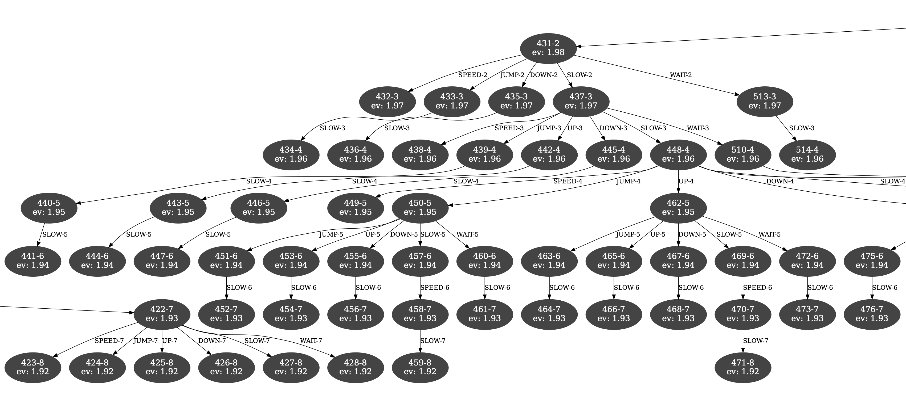
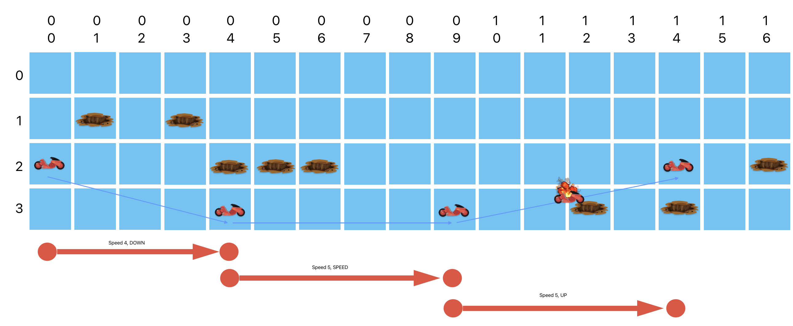

# My Solution

> ⤴️ [README.md](../README.md)

These types of challenges require the use of a search algorithm to compute the best next move for each turn based on the current state of the game. This is commonly done using a search tree consisting of possible moves and the uses a heuristic to determine the best move.  

The challenge requires the application of computer science concepts such as [recursion](https://en.wikipedia.org/wiki/Recursion#:~:text=Recursion%20in%20computer%20programming%20is,simpler%20versions%20of%20the%20problem), [data structures](https://en.wikipedia.org/wiki/Data_structure) (particularily, [trees](https://en.wikipedia.org/wiki/Tree_(data_structure))) and search algorithms such as [depth first search](https://en.wikipedia.org/wiki/Depth-first_search) and [backtracking](https://en.wikipedia.org/wiki/Backtracking).   Due to the complexity of the problem, it's not possible to [brute force](https://en.wikipedia.org/wiki/Brute-force_search) a solution.  The use of [heuristics](https://en.wikipedia.org/wiki/Heuristic_(computer_science)) such as [alpha-beta pruning](https://en.wikipedia.org/wiki/Alpha%E2%80%93beta_pruning) are required to solve the problem in real-time.

> As a side note, even a family member's CS class at Dartmouth didn't seem to address all of those topics. Granted he may still encounter them later in his studies.

In my solution I also built a simulator that closely models the one online.  The simulator, included in this repo, uses [unix system pipes](https://en.wikipedia.org/wiki/Pipeline_(Unix)) to communicate with the client application which hosts the game AI.  This wasn't required but I had time on my hands and having control of both ends of the problem made it easier to debug and test my solution.

In my solution when a winning move is found it's returned immediately. Even if it's not the best move. This is necessary because the simulation will terminate the game if the AI doesn't return a move within a certain amount of time. That said, my solution has a `full_search` flag on the `Bike_AI` class that will force the AI to search the entire tree before returning a move. That was useful for debugging and testing but can't be used in production.

```python
Bike_AI(simulator, use_graphviz=False, debug=False, full_search=False)
```

## Depth first search

I used a [depth first search algorithm](https://en.wikipedia.org/wiki/Depth-first_search) to build the search tree.  This is a common approach for these types of problems.  It's particularily important in my solution because this allows for a move sequence to be evaluated and for the evaluation score to be used to eliminate other potential moves.
See my note on `alpha-beta pruning` below.

## The heuristic

In order to constrain the size of the search tree I used a heuristic that scores each potential move.  Below is the score code snipit:

```python
  child_state = self.simulator.process(new_state)
  score = child_state.remaining_bikes - ((node.depth + 1) * 0.01)
  if score < self.highest_score:
      continue
```

The heuristic scores a potential move based on the number of bikes remaining after a move. A penalty is then applied based on the depth of the move in the search tree. That results in scores that favors more bikes crossing the bridge earlier, i.e., sorter solutions.

The best score identified is then used to eliminate all other potential moves that have a lower score.  This is a common technique, called [alpha-beta pruning](https://en.wikipedia.org/wiki/Alpha%E2%80%93beta_pruning), that is used to reduce the size of the search trees.

## Useful tools
#### Graphviz
Early on I wanted to visualize the search tree to help me debug and understand the AI's behavior.  I used the [graphviz](https://graphviz.org/) library to generate a graph of the search tree. I built the `graphviz.py` wrapper module for this purpose.  The `Bike_AI` class has a `use_graphviz` flag that can be used to enable/disable the graphviz graph generation. Note that after about 5-10 turns the graph becomes too large to be useful.  This is where I generated custom test cases to help limit the size of the graph.



> A PDF of a larger graph can be found [here](./search-tree.pdf). Note you'll need a PDF viewer that allows you to zoom in to see the details.

#### Apple Freeform
I also used [Apple's Freeform](https://apps.apple.com/us/app/freeform/id6443742539) to visually think through challenges using a digital whiteboard.



## Core AI files
The following files make up the core AI.

| File | Description |
| --- | --- |
| source/bike_ai.py | The AI that computes the best next move for each turn. |
| source/simulator.py | A module that manages the states of the simulator and also processes and scores potential moves.  Used by the `bike_ai.py` module and the `simulation_tester.py` module. |
| source/state_search_space_tree.py | A module that defines the state nodes and search space tree. |
